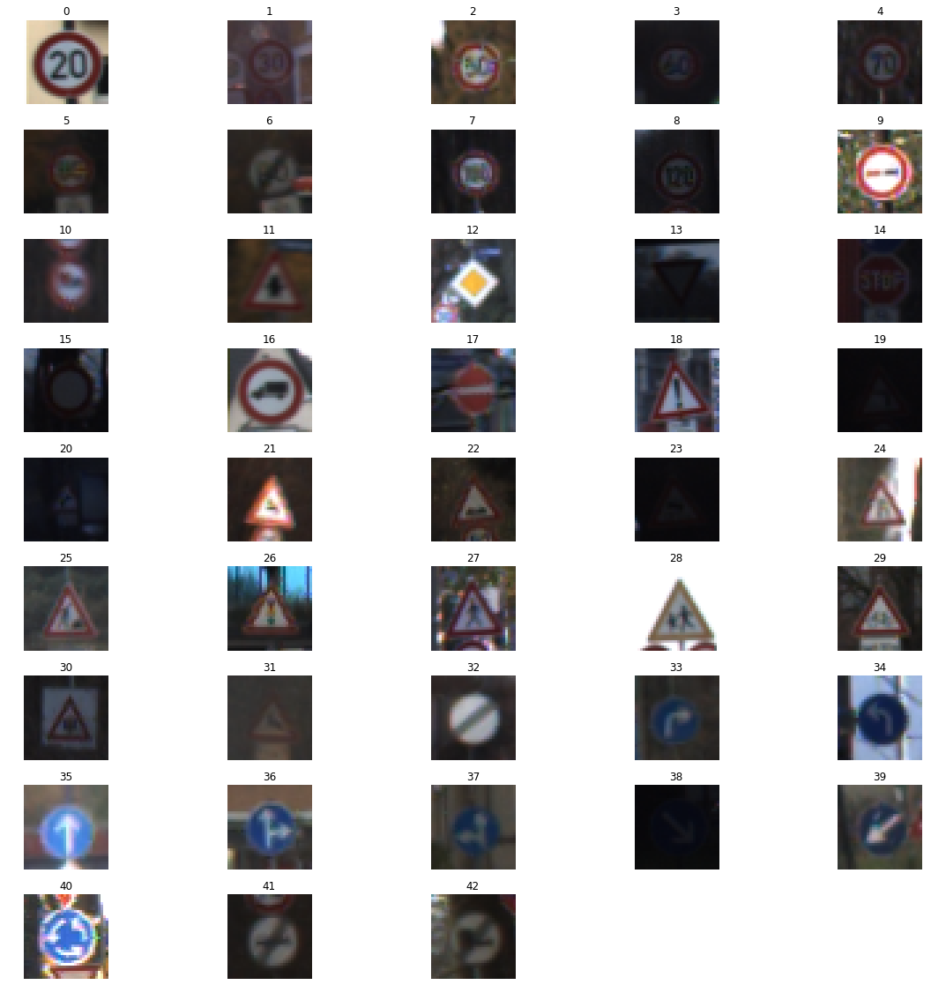
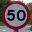
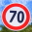

# Deep Learning to Identify Traffic Signs

In the second project of the self-driving car engineer course, I implemented and trained the [LeNet-5](http://yann.lecun.com/exdb/lenet/) deep neural network architecture to identify traffic signs as per the [German traffic sign system](http://benchmark.ini.rub.de/?section=gtsrb&subsection=dataset).

The research paper titled [Traffic Sign Recognition with Multi-Scale Convolutional Networks](http://yann.lecun.com/exdb/publis/pdf/sermanet-ijcnn-11.pdf) by the same inventor of the LeNet-5 architectures (Yann LeCun) was used as a reference.

The project consisted of the following stages:

1. Summarize and visualize the dataset.
2. Implementation of the LeNet-5 neural network.
3. Train and validate the model.
4. Test the model on new images.

## Summarize and visualize the dataset

The full dataset consisted of 51,839 images RGB images with dimensions 32x32.

34,799 images were used as the training dataset, 12,630 images were used as the testing dataset, and 4,410 images were used as the validation dataset.

A validation set was used to assess how well the model is performing. A low accuracy on the training and validation
sets implies underfitting. A high accuracy on the training set but low accuracy on the validation set implies overfitting. The validation set was purely used to calibrate the network's hyperparameters.

In total, the dataset consisted of images belonging to 43 classes. Each class corresponds to a specific sign, for example, the class with label 4 represents 70km/h speed limit signs, and the class with label 25 represents a roadwork sign.

A sample from each class is shown in the image below:

## Implementation of the LeNet-5 neural network

The pixel data of each image was normalized, and then fed into the LeNet-5 neural network which consisted of the following layers:

| Layer         		|     Description	        					| 
|:---------------------:|:---------------------------------------------:| 
| Input         		| 32x32x3 RGB image   							| 
| Convolution 5x5     	| 1x1 stride, valid padding, outputs 28x28x6 	|
| RELU					| Rectified linear unit							|
| Max pooling	      	| 2x2 stride,  outputs 16x16x6 				    |
| Convolution 5x5     	| 1x1 stride, valid padding, outputs 10x10x16 	|
| RELU					| Rectified linear unit							|
| Max pooling	      	| 2x2 stride,  outputs 5x5x16    				|
| Flatten       	    | outputs 400  									|
| Fully connected		| input 400, outputs   120     					|
| RELU  				| Rectified linear unit			 				|
| Fully connected		| input 120, outputs 84							|
| RELU					| Rectified linear unit							|
| Fully connected		| input 84, outputs 43							|

A rectifier was used as an activation function as it has been shown in a paper titled [Deep Sparse Rectifier Neural Networks](http://jmlr.org/proceedings/papers/v15/glorot11a/glorot11a.pdf) that it performs better than the sigmoid activation function.

### Train and validate the model

The network was ran 50 times (epochs) and the data was fed into the network in batches of 200 to reduce memory footprint.

The AdamOptimizer algorithm was used to optimize the objective function, instead of the gradient descent algorithm. The Adam algorithm uses momentum to zone-in on the ideal learning-rate during training, unlike the gradient descent algorithm where the learning rate hyperparameter will have to be manually tuned at the start and doesn't cahnge during the training process. The Adam algorithm is laid out in a paper titled [Adam: A Method for Stochastic Optimization](https://arxiv.org/pdf/1412.6980v8.pdf).

The network achieved an accuracy of **93.7% on the validation set** and an accuracy of **91.7% on the test set**.

### Test the model on new images

The following five traffic signs were pulled from the web and used to test the model:

**The model correctly guessed 4 of the 5 traffic signs** as per the below table:

| Image			        |     Prediction	        							| 
|:---------------------:|:-----------------------------------------------------:| 
| Right-of-way at the next intersection | Right-of-way at the next intersection | 
| Speed limit (50km/h)     				| Ahead only 							|
| Speed limit (70km/h)					| Speed limit (70km/h)					|
| Stop	      							| Stop									|
| End of all speed and passing limits	| End of all speed and passing limits	|
